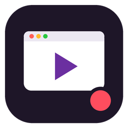

# ClickReel

Grava vídeos de demonstração de sites (uma compra, um cadastro, um tutorial) a partir de uma
lista de passos. O vídeo sai em MP4 com cursor animado, zoom automático nos cliques, legendas
e moldura de navegador, tablet ou celular.



## O que faz

- **Lista de passos**: abrir página, clicar, digitar, escolher opção, rolar, passar o mouse,
  apertar tecla, aguardar, pausa e legenda.
- **🎯 Apontar no site**: abre o site, você clica no botão ou campo e o alvo é preenchido
  (e conferido) sozinho.
- **◉ Criar passos navegando**: você usa o site normalmente e cada clique ou digitação vira
  um passo.
- **Formatos**: Desktop (16:9), Tablet em pé (9:16), Tablet deitado (16:9) e Celular (9:16).
  O site é aberto de verdade no tamanho do aparelho.
- **Gravar nos 3 formatos**: um clique gera desktop, tablet e celular. Cada passo pode valer
  em todos os formatos ou só em alguns.
- **Efeitos**: cursor com onda no clique, zoom que acompanha a ação, legendas animadas,
  fundo em degradê, barra de endereço, música de fundo e encurtamento dos carregamentos.
- **Remontar**: troca fundo, zoom, legenda ou música sem gravar de novo.
- **🔒 Borrão de dados sensíveis**: campos de CPF, cartão e senha são borrados na própria
  página antes da captura (o dado nunca entra no vídeo), inclusive quando o mesmo valor aparece
  em páginas seguintes. A lista "Esconder na tela" borra qualquer outro campo ou texto.
- **Pausar / Parar** durante testes e gravações, com a espera de cada passo mostrada ao vivo.
- **Tema claro, escuro ou automático** no painel.
- **🔊 Narração automática**: uma voz em português lê as legendas (ou um texto próprio por passo).
  Vozes neurais da Microsoft (grátis, com internet) ou a voz do Windows (offline). A gravação espera
  cada fala terminar.
- **🎬 Abertura e encerramento**: título, subtítulo, chamada final, endereço e QR code.
- **🏷 Logo (marca d'água)** no canto escolhido, com tamanho e opacidade.
- **Destacar elemento**: escurece a tela, ilumina um botão ou preço e mostra um balão explicativo.
- **📦 Arquivos extras**: capa (.jpg), GIF animado e legendas (.srt) junto do MP4.
- **👁 Prévia rápida**: vídeo leve para conferir antes de montar em alta qualidade.
- **🔐 Login lembrado**: entre no site uma vez; o ClickReel reaproveita a sessão sem guardar a senha.
- **Iframes**: encontra campos dentro de janelas embutidas (ex.: cartão do gateway).
- **Fluxos com e-mail** (ex.: resetar senha): segue links que abrem em outra aba e o passo
  "Aguardar aparecer" pode recarregar a página até o e-mail chegar. Logins lembrados usam o
  Google Chrome instalado, quando houver.
- **☰ Fila**: grava vários roteiros em sequência.
- **Aviso de atualização** quando sai uma versão nova em Releases.
- **Qualidade**: tela do Desktop em 1280×720, 1600×900 ou 1920×1080; vídeo em 1080p, 1440p ou 4K;
  modo "Máxima" com captura mais nítida e menos compressão.

## Instalar

### Windows (instalador)
Baixe `ClickReel-Setup-x.y.z.exe` em **Releases** e instale. Não precisa de Node nem de
mais nada. O instalador cria o ícone na Área de Trabalho.

### A partir do código
Requer [Node.js](https://nodejs.org) 18 ou mais novo.

```bash
npm install
npx playwright install chromium
npm start            # abre http://localhost:4580
```

No Windows, `INSTALAR.bat` faz tudo isso e cria o atalho; depois use `ABRIR-PAINEL.bat`.

## Gerar o instalador `.exe`

O workflow `.github/workflows/instalador.yml` gera o instalador num Windows do GitHub:

- **Manual**: *Actions → Instalador Windows → Run workflow*. O `.exe` aparece em *Artifacts*.
- **Versão**: `git tag v1.1.0 && git push --tags`. O `.exe` é anexado à *Release*.

O instalador (Inno Setup, `instalador/clickreel.iss`) leva o Node portátil, o Chromium do
Playwright e o ffmpeg, e instala por usuário, sem pedir administrador.

## Como funciona

```
painel (public/)  ──►  server.js  ──►  lib/gravador.js     Playwright executa os passos e captura
                                       │                    os quadros (CDP screencast) + linha do tempo
                                       ├► lib/renderizador.js  public/compositor.html desenha cada quadro
                                       │                       (cursor, zoom, legenda, moldura) → ffmpeg → MP4
                                       ├► lib/apontador.js     "Apontar no site"
                                       └► lib/captura.js       "Criar passos navegando"
```

| Pasta | Conteúdo |
|---|---|
| `roteiros/` | roteiros salvos (`.json`) |
| `videos/` | vídeos prontos |
| `musicas/` | músicas de fundo (`.mp3`) |
| `demo/` | loja de exemplo para testar (`http://localhost:4580/demo/`) |
| `.gravacoes/` | gravações brutas usadas pelo "Remontar" (não vão para o Git) |

## Cuidados

- Use dados fictícios. Não finalize pagamentos reais e apague pedidos de teste da loja.
- Senhas digitadas num roteiro ficam salvas no arquivo `.json`. Use um usuário de teste.
- Ainda não funciona: campos dentro de iframes (por exemplo, o cartão do gateway), upload
  de arquivos e captchas.

## Licença

[MIT](LICENSE) © 2026 Leon Rissato. O instalador inclui FFmpeg, Playwright, Chromium e
Node.js, cada um com a sua licença: veja [THIRD-PARTY-NOTICES.md](THIRD-PARTY-NOTICES.md).
